# 

  

  jyadmin 简意后台脚手架

  
  
  
  

## 介绍

简意后台脚手架，方便用户进行二次开发。

## 架构设计

## 功能列表

**1 系统管理**

- [x] 1.1 用户管理

- [x] 1.2 角色管理

- [x] 1.3 菜单管理

- [x] 1.4 接口管理

- [x] 1.5 数据字典管理

- [x] 1.6 系统信息管理

- [x] 1.7 系统动态配置

- [x] 1.8 附件管理

- [x] 1.9 短信服务

- [x] 1.10 邮件服务

- [x] 1.11 任务管理（定时任务）

- [ ] 1.12 线程池管理

- [x] 1.13 部门管理

- [x] 1.14 岗位管理

- [x] 1.15 系统基础信息配置

**2 系统监控**

- [x] 2.1 服务器监控

- [x] 2.2 用户下线

- [x] 2.3 日志管理
  
  - [x] 2.3.1 登录日志
  
  - [x] 2.3.2 行为日志

- [x] 2.4 API文档

- [x] 2.5 数据库监控

**3 系统运维**

// 暂无...

**4 系统业务**

- [ ] 4.1 仪表盘展示

- [ ] 4.2 开发文档

- [ ] 4.3 系统公告

**5 系统工具**

- [ ] 5.1 代码生成器

- [x] 5.2 表单拖拽工具

- [ ] 5.3 动态API接口

**6 系统组件**

- [ ] 6.1 地图GIS

- [ ] 6.2 流程设计

- [ ] 6.3 大屏设计

**7 系统插件**

// 暂无...

### 技术栈描述

| 名称              | 作用         | 版本   | 备注                                                         |
| ----------------- | ------------ | ------ | ------------------------------------------------------------ |
| **语言**     |              |        |                                                              |
| Java              |              | 11     |                                                              |
|      -             |              |        |                                                              |
| **数据库**    |              |        |                                                              |
| MySQL             | 数据库       | 8      |                                                              |
| Redis             | 缓存         | 5      |                                                              |
| ELK               | 日志管理     | 7.6.2  |                                                              |
|      -             |              |        |                                                              |
| **后端技术**  |              |        |                                                              |
| SpringBoot        |              | 2.5.12 | https://docs.spring.io/spring-boot/docs/2.5.12/reference/html/ |
| Mybatis           |              |        | http://www.mybatis.org/mybatis-3/zh/index.html               |
| MybatisPlus       |              |        | https://baomidou.com/                                        |
| Druid             | 数据库连接池 |        |                                                              |
| Quartz            | 定时任务     |        |                                                              |
| RabbitMQ          | 消息队列     |        |                                                              |
|   -                |              |        |                                                              |
| **前端技术**  |              |        |                                                              |
| Vue               |              | 2.0    |                                                              |
| Element           | 后端UI框架   |        |                                                              |
| Vue-Element-Admin | 后端模板     |        | https://panjiachen.github.io/vue-element-admin-site/zh/guide/ |
| Vant              | 移动端UI框架 |        | https://vant-contrib.gitee.io/vant/v2/#/zh-CN/home           |
| -                  |              |        |                                                              |
| **文档**      |              |        |                                                              |
| ApiFox            | API文档      |        |                                                              |
| knife4j           | API文档      |        | https://doc.xiaominfo.com/knife4j/documentation/get_start.html |
| Docsify           | 文档编写     |        | https://www.cnblogs.com/throwable/p/13605289.html            |
|       -            |              |        |                                                              |
| **部署**      |              |        |                                                              |
| CentOS7           |              |        |                                                              |
| Nginx             |              |        |                                                              |
| Docker            |              |        |                                                              |
| Jenkins           |              |        |                                                              |
|                   |              |        |                                                              |

## 界面展示

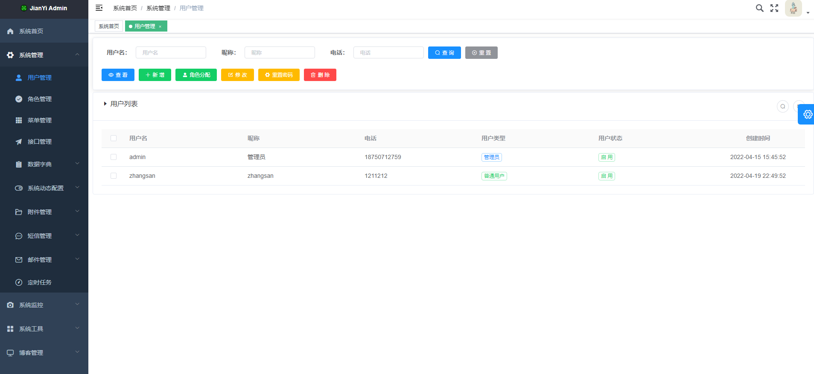

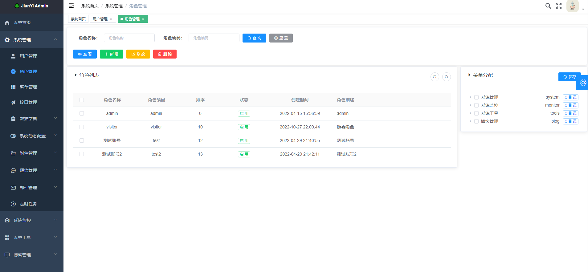

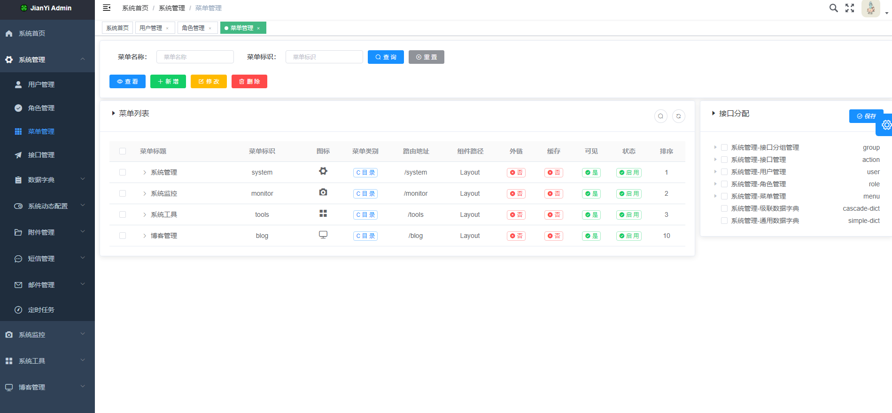

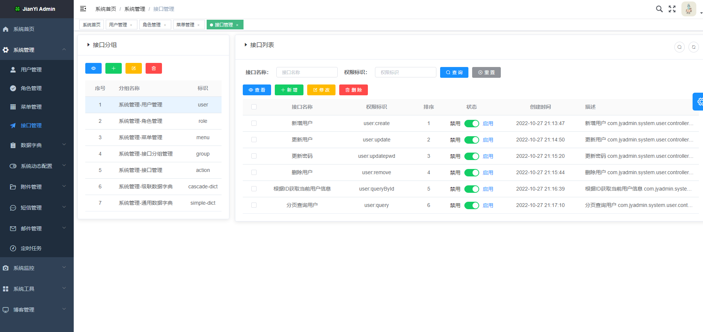

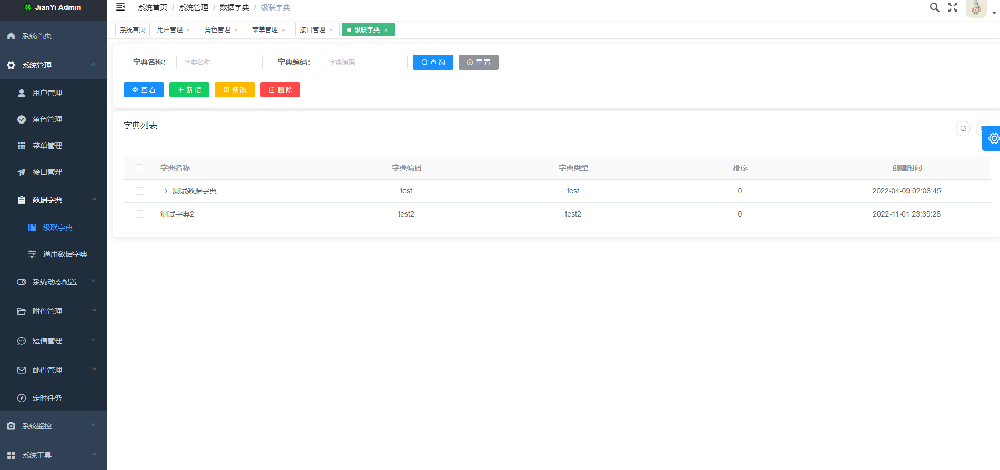

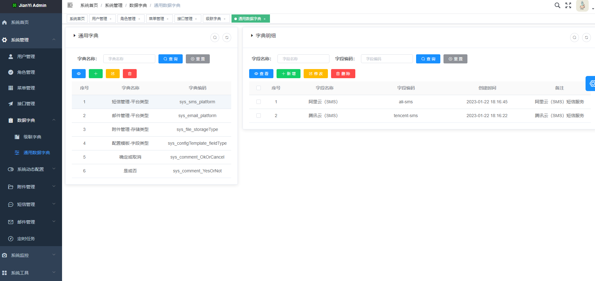

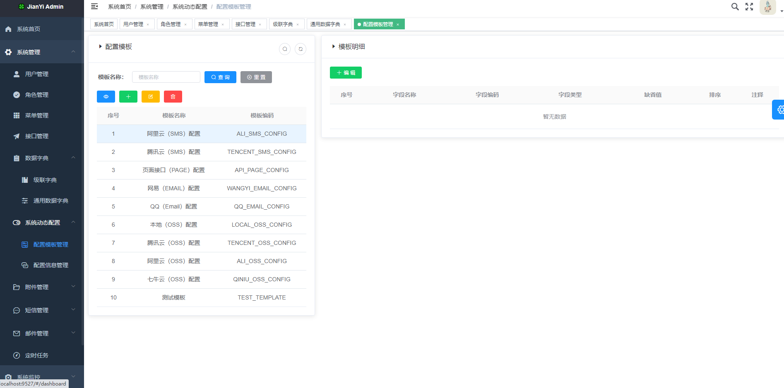

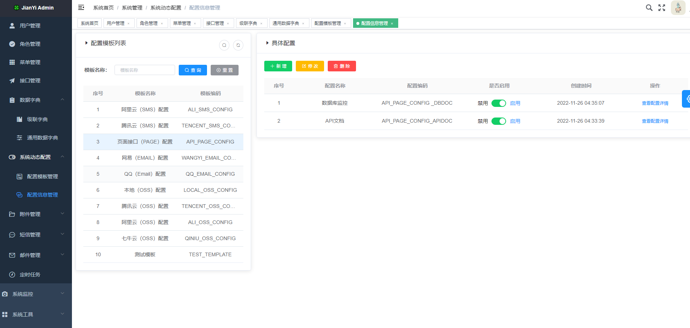

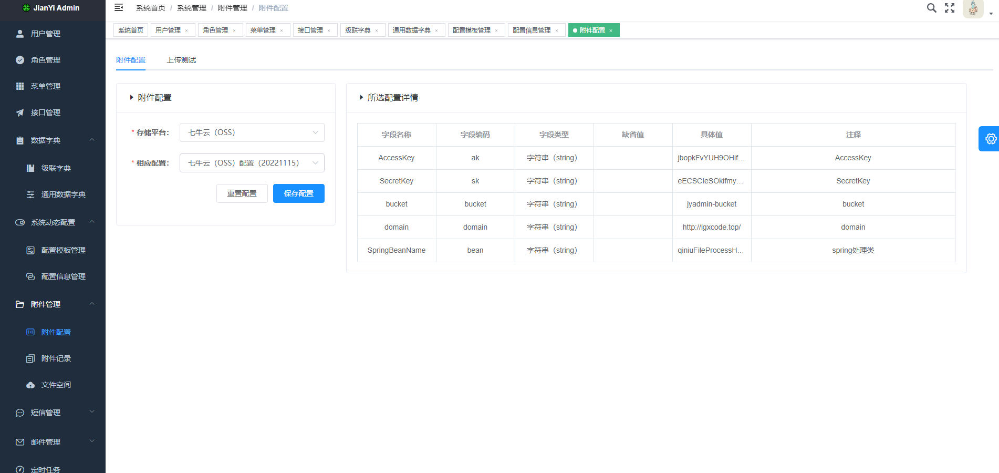

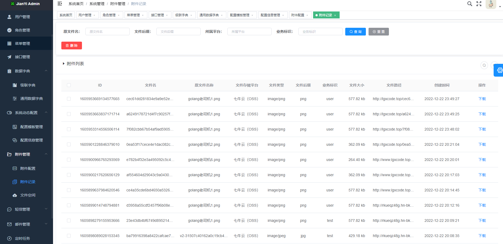

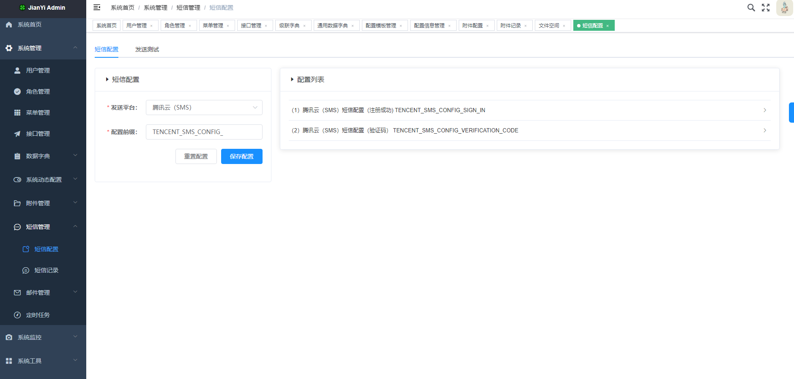

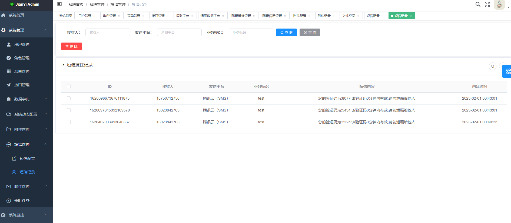

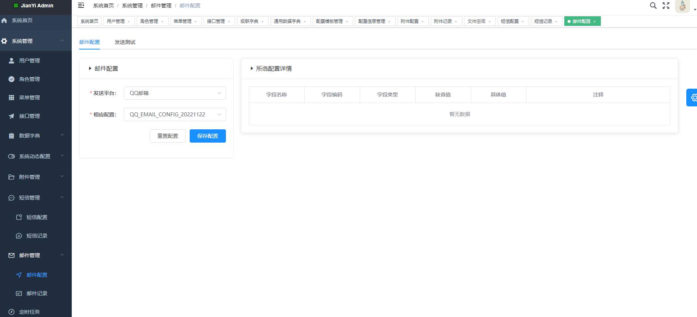

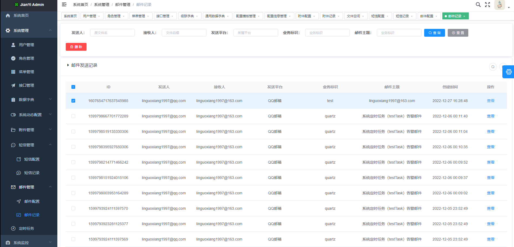

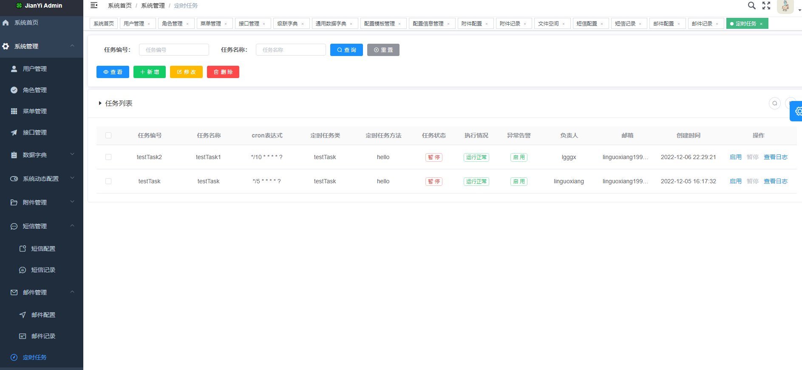

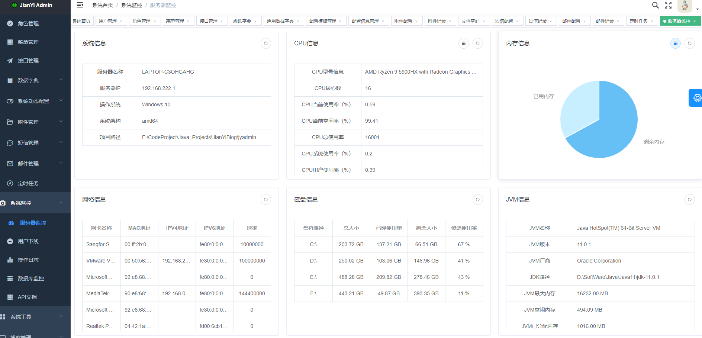

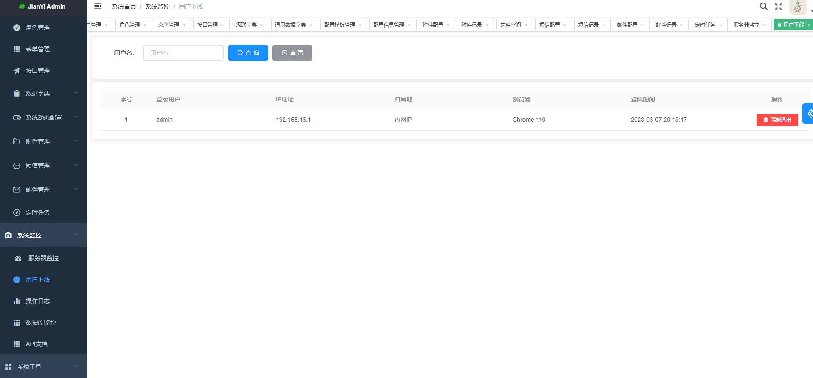

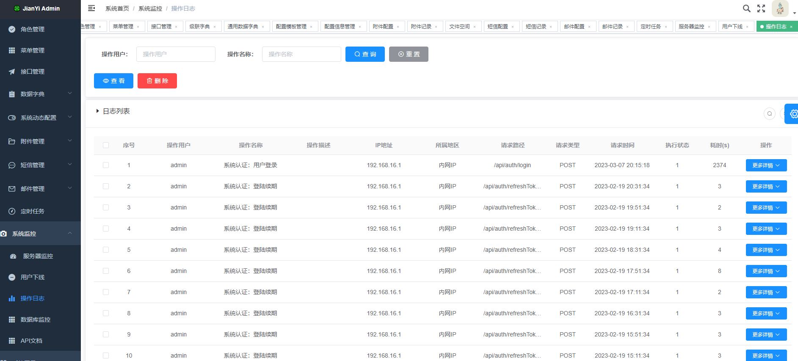

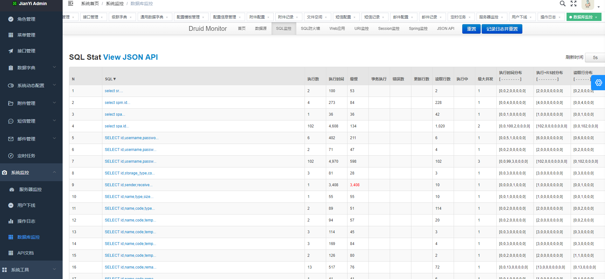

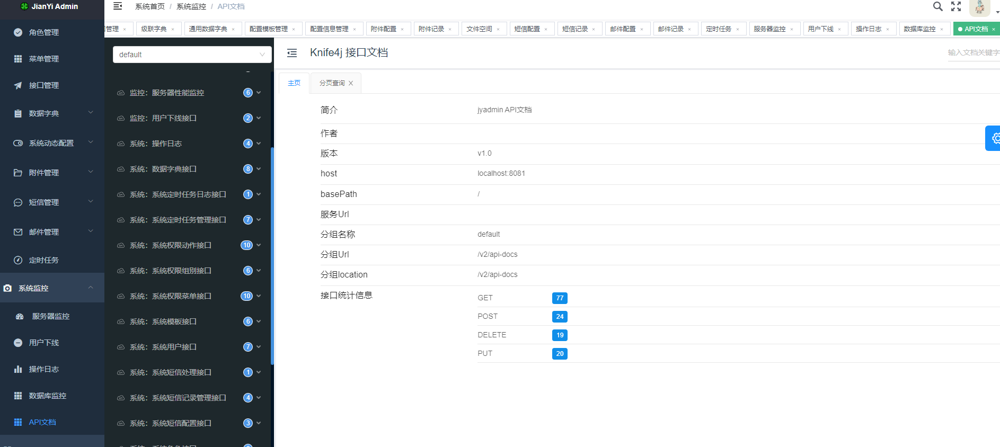

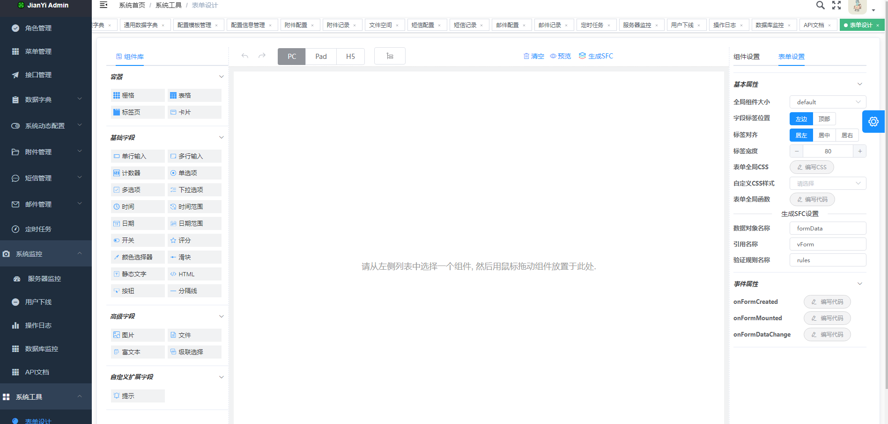

